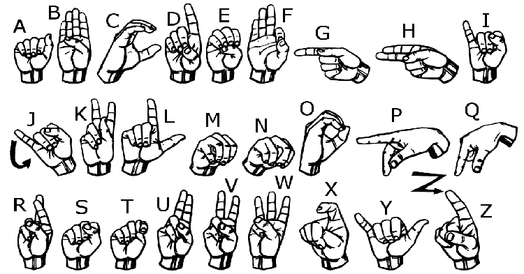

# Hand Sign Detector

This is a personal learning project for creating a hand sign detector using Python, Mediapipe, OpenCV, and Scikit-Learn.

## Instructions

1. **Run `collect_imgs.py`**: Record hand signs as instructed. (For guidance, refer to the video link in the Credits section.)
2. **Run `create_dataset.py`**: Prepare the dataset for training.
3. **Run `train_classifier.py`**: Train the classifier using the prepared dataset.
4. **Run `inference_classifier.py`**: Test the hand signs and observe the results.

## Collecting Images Data

After running `collect_imgs.py`, you will record each hand sign in {two} modes:

### Normal

Move your hand back and forth at a moderate speed while keeping the hand sign still.

### Rotating

Circle your wrist and slightly rotate your hand. Avoid excessive rotation.

## Notes

- This program can handle only three different signs as of now.

### Hand Signs Instruction Image

## Credits
Special thanks to this [video](https://youtu.be/MJCSjXepaAM?si=fnUC_G2CNiA_KcuO).
